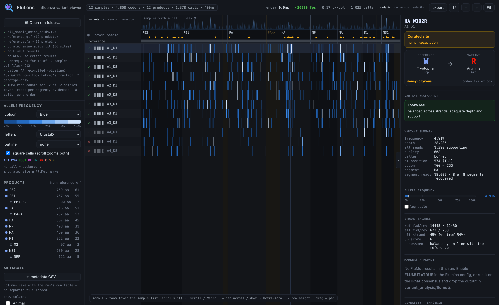
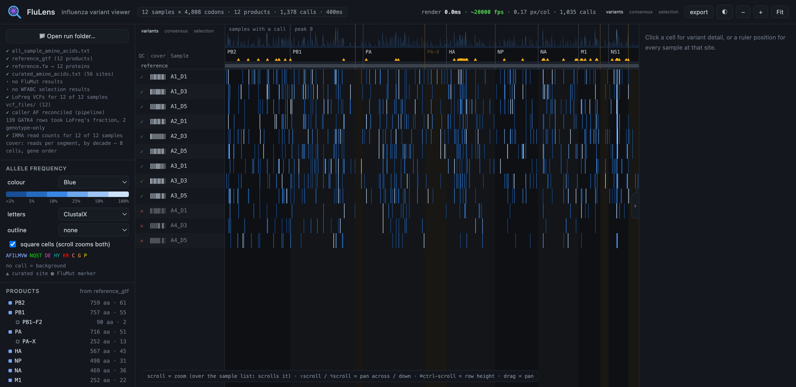

FluLens is a viewer for influenza variant calls. You can inspect and filter them.
The grid shows **samples × codons**, one cell per call. FluLens colours each cell by
allele frequency, or shows it as a consensus.

FluLens reads the output of [Flumina](https://github.com/flu-crew/Flumina). It helps you
answer two questions more quickly than a spreadsheet: *is this variant real?* and
*is this sample good enough to keep?*

**[▶ Try it in your browser](https://flu-crew.github.io/FluLens/?run=example_run)** —
no installation, with example data.



---

## Running it

There are three ways to run FluLens. They are the same application. Use the one you like.

| | Use when |
|---|---|
| [1. In a browser](#1-in-a-browser) | Simplest. Nothing to install, works on any OS |
| [2. As a single file](#2-as-a-single-file) | You want it offline, or on a machine with no internet |
| [3. As a desktop app](#3-as-a-desktop-app) | macOS, and you want it to remember your last run [coming soon]|

### 1. In a browser

Open **<https://flu-crew.github.io/FluLens/>**. Click **Open run folder…**. Then
select a Flumina output folder.

FluLens uploads nothing. The page reads the folder on your machine through the browser's
file picker. See [Your data stays on your machine](#your-data-stays-on-your-machine).

### 2. As a single file

FluLens is one HTML file. It has no dependencies and no build step.
Download `flulens.html` from the
[latest release](https://github.com/flu-crew/FluLens/releases/latest) and open it.

```bash
open flulens.html        # macOS
xdg-open flulens.html    # Linux
```

### 3. As a desktop app [coming soon]

Download `FluLens_<version>_universal.dmg` from the
[latest release](https://github.com/flu-crew/FluLens/releases/latest). Open it and
drag FluLens to Applications. The build is universal — it runs on Apple Silicon and Intel.

The desktop version can read the filesystem. It reopens your last run
automatically, so it does not ask each time.

> **If macOS says it cannot verify the app**, the release is not signed. You can
> get it from a signed release, or you can permit it one time. Go to **System Settings →
> Privacy & Security → Open Anyway**.

There are Windows and Linux builds on the releases page too. On both systems, the browser
version is the better choice.

---

## Try it with the example dataset

You do not need a pipeline run to see FluLens. `example_run/` is a small
**synthetic** Flumina output: twelve samples, 1,378 calls, and all twelve gene
products.

**[▶ Open it live, nothing to download](https://flu-crew.github.io/FluLens/?run=example_run)**

You can also load it on your machine. This is a good way to test the desktop app
and the folder picker before you use real data:

| Get it | How |
|---|---|
| [Browse it on GitHub](https://github.com/flu-crew/FluLens/tree/main/example_run) | see the file layout a run must have |
| [`example_run.zip`](https://github.com/flu-crew/FluLens/releases/latest) | attached to every release |
| [Download the whole repository](https://github.com/flu-crew/FluLens/archive/refs/heads/main.zip) | `example_run/` is inside it |

```bash
git clone https://github.com/flu-crew/FluLens.git
# then in FluLens: Open run folder… -> FluLens/example_run
```

The example gives the controls something to act on. It contains a library that
fails QC, two segments that did not assemble, GATK4 genotype calls with no LoFreq
counterpart, and skewed strand balance on some of the calls.

All twelve samples also include **reads**, so the pile-up opens on the example.
Click any sample in the `read pile-up` view. The BAMs are capped at ~200×
depth to keep them small. A real `A1` BAM would be 86 MB. The allele fractions stay
correct; only the read count is thinned. `example_run/README.md` explains why.

---

## What to load into FluLens

Load a Flumina output folder — the one that contains `variant_analysis/`. Only the first
file is required; the rest are optional. The sidebar reports which files FluLens found:

| Path | What it adds |
|---|---|
| `variant_analysis/all_sample_amino_acids.txt` | **required** — the grid itself |
| `reference.fa` | the translated reference row |
| `reference_gtf/*.gtf` | true protein lengths and CDS intervals, so all twelve products appear |
| `variant_analysis/curated_amino_acids.txt` | ▲ ticks marking curated sites |
| `variant_analysis/flumut/markers.tsv` | FluMut marker screening |
| `variant_analysis/flumut_lowfreq/` | markers present *below* consensus |
| `vcf_files/<sample>/lofreq-called-variants.vcf` | strand balance and read counts, read on demand |
| `IRMA_results/<sample>/tables/READ_COUNTS.txt` | the per-segment coverage strip |
| `wfabc*/FIT_results.csv` | selection coefficients and drift tests |

You can load a **metadata CSV** on its own if the run had no metadata. The sidebar
reports how many samples the join matched. That number is the one to read: a join that
matched half your samples looks the same as a join that matched all of them.

If you have no run of your own, the
[example dataset](#try-it-with-the-example-dataset) above fills every one of these.

---

## What it shows



**The matrix.** It shows every call in the run, placed by product and codon. Use the
wheel to zoom and drag to pan. Click a sample name to highlight its row. Drag a name to
move it. Click any header to sort; shift-click to add a second sort key.

**Variant detail.** Click a cell. FluLens loads that one sample's VCF. It shows
the amino-acid change, the raw numbers, the allele frequency on a linear or log axis,
the strand balance against the *reference* allele, and a verdict.

**Variant assessment.** There are four verdicts — *Looks real*, *Treat with caution*,
*Likely artefact*, and *Cannot assess*. Each verdict lists its reasons. It weighs strand
balance, depth, allele frequency, and the number of reads that support the
call. Supporting reads are not the same as depth: a 0.5% call on 15,000× has high depth
but may rest on only a few alt reads.

**Consensus view.** It shows each sample's own residue at every codon. It draws only the
differences from the reference, not a full field of colour.

**Coverage strip.** It shows the reads recovered per segment, per sample, by decade. The
variant table cannot tell you that a segment recovered 5,455 reads and not
509,426; this strip can.

**QC column.** It gives a per-sample verdict from the raw variant table. The verdict does
not change with your filters, because QC is a fact about the library and not
about the view. Click the mark to override it.

**FluMut markers**, **SNPGenie diversity layers**, **WFABC selection results**, and
**export** to CSV, TSV, TXT, JSON, Markdown, or VCF. Each file has a header that
records the filters that made it.

---

## Things to know before you trust a number

These are properties of the data, not of this viewer. You cannot see them
in the tables themselves.

**LoFreq and GATK4 do not report the same quantity.** LoFreq's allele frequency is
an allele *fraction*. GATK4's is a *genotype* — a hom-alt call reads 1.0 whatever
the reads say. At one measured site, LoFreq said 85.98%, GATK4 said 100%, and the
reads said 85.44%. FluLens reconciles this at load. It gives GATK4 rows LoFreq's
fraction where both callers found the same change. It flags the rest as
genotypes. The consensus excludes genotype-only calls, because you cannot read a genotype
as "above 50%".

**Both callers emit a row for the same change**, so the table has two rows per
variant at most sites. To count calls per codon, first remove the duplicates by
position and alternative.

**FluMut's HA and NA markers use H5/N1 numbering.** `HA1-5` means H5 HA1 numbering
and `NA-1` means N1 NA numbering. So on an H3N2 run, those positions use the wrong
numbering. The internal genes — PB2, PB1, PA, NP, and NS — do not depend on subtype and
are correct. FluLens finds the subtype from the reference segment
names. It marks the HA and NA findings that it cannot confirm. A bare `A_HA` with no
subtype suffix counts as unconfirmable, not as a pass.

**Depth below 100 makes false fixed differences.** With low template input, both callers
report false fixed differences. This is why Flumina's own floor is `min_depth 100`, and
why FluLens downgrades any verdict below it.

**The assessment thresholds are absolute. They are not the sidebar sliders.** If they were
the sliders, a slider would change the verdict that the same slider then filters on. The
panel shows where a call sits against your current filters, but the filters do not change
the verdict.

**In the SNPGenie layer, 99.1% of cells have πN or πS at zero.** At one
codon in one sample, the value mostly reports *which kind* of difference it
found, not which one is larger. The result is the pattern across many codons.

---

## Your data stays on your machine

FluLens has no server and makes no network requests. The browser version reads
your run folder through the file picker. The desktop version reads it from disk.
It uploads nothing. The hosted page at `flu-crew.github.io` is a static file. You could
save it and run it offline with no change in behaviour.

---

## Building from source

The browser version needs no build: `prototypes/flulens.html` *is* the
application. Edit it and reload.

The desktop app is a [Tauri](https://tauri.app) shell around that same file:

```bash
cargo install tauri-cli --version "^2" --locked
rustup target add aarch64-apple-darwin x86_64-apple-darwin
cd desktop && cargo tauri build --target universal-apple-darwin
```

> **The binary contains the compiled frontend.** If you edit `prototypes/flulens.html`,
> the desktop app shows no change until you rebuild. People forget this often and lose
> time.

More reading, all of it for maintainers:

- [`docs/CONTRIBUTING.md`](docs/CONTRIBUTING.md) — how the two run loaders work,
  how to regenerate the example, and the mistakes that often cost people time
- [`docs/RELEASING.md`](docs/RELEASING.md) — how to sign, notarise, and cut a
  release. Read the DMG section before you ship one: Tauri notarises the app but
  not the disk image, so a good build can still make a download that macOS blocks
- [`desktop/README.md`](desktop/README.md) — the design of the Tauri shell

---

## Citing

If FluLens helped your published work, please cite it — see
[`CITATION.cff`](CITATION.cff). Please cite
[Flumina](https://github.com/flu-crew/Flumina) too if you used the pipeline
that made the data.

## License

GPL-3.0-or-later, the same as Flumina. See [`LICENSE`](LICENSE).
